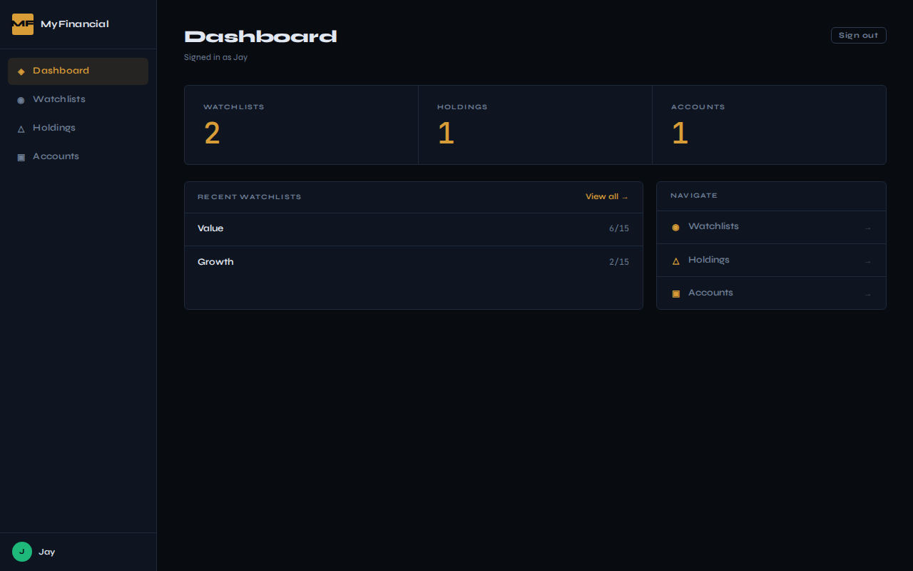
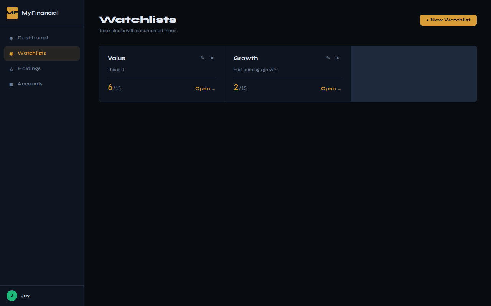
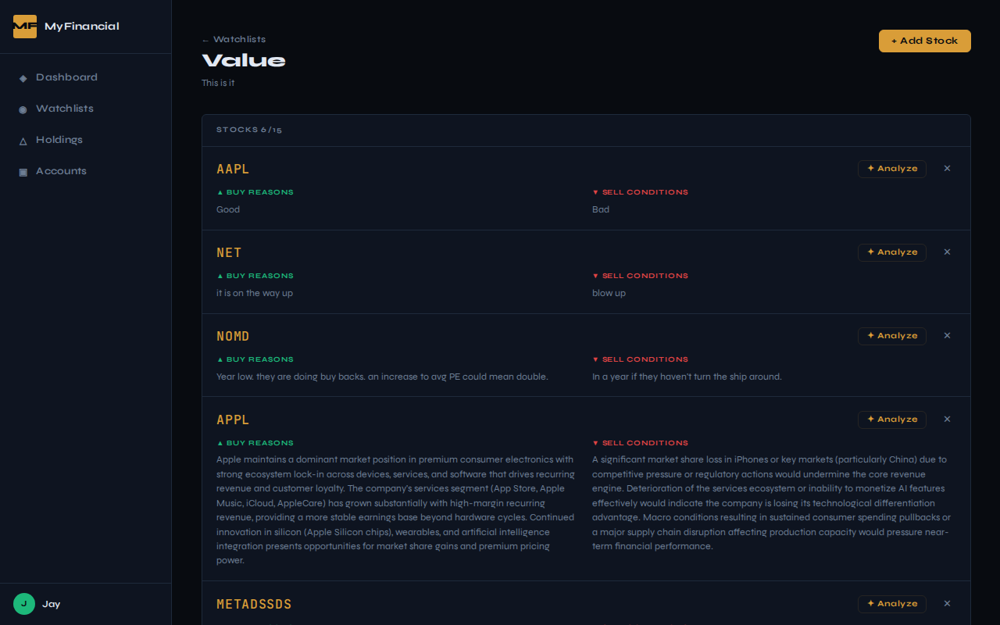
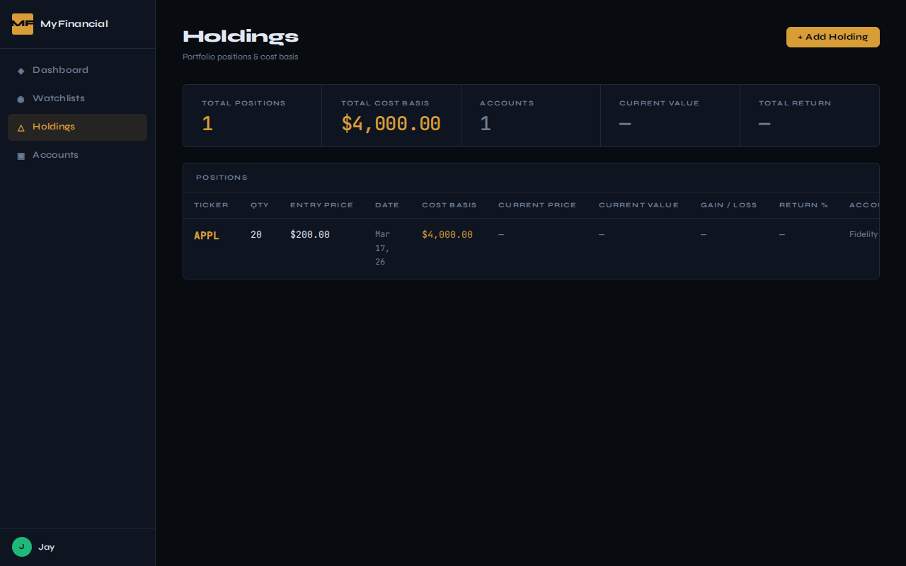

# MyFinancial 📈

> A personal investment tracker that enforces discipline — you must document *why* you're buying before you buy.

Most retail investors lose money not because they pick bad stocks, but because they make emotional decisions: panic selling at the bottom, chasing momentum, holding losers too long. MyFinancial addresses this by requiring users to write a **buy thesis** and explicit **sell conditions** before adding any stock to a watchlist. The investment case is always front and center.

---

## The Problem It Solves

Standard brokerage apps show you prices and let you trade. They don't help you think. This app separates the *research phase* (watchlists + thesis) from the *action phase* (holdings + transactions), creating a natural checkpoint between idea and execution.

**Key question this app answers:** *"Why did I buy this, and under what conditions should I sell?"*

---

## Screenshots

| Dashboard | Watchlists |
| --- | --- |
|  |  |

| Watchlist Detail (thesis + triggers) | Holdings & P&L |
| --- | --- |
|  |  |

---

## Features

### Investment Discipline

- Write a **buy thesis** (why this stock belongs in your portfolio)
- Define **sell conditions** before opening a position
- Set price triggers: buy target, profit target, stop-loss percentage
- All decisions are dated and editable — your reasoning becomes an audit trail
- **AI-powered thesis analysis** via Claude API — surfaces gaps in your reasoning and suggests sell conditions you may have missed

### Watchlists

- Organize stocks into named watchlists (max 15 per list — a deliberate constraint to avoid dilution)
- Track thesis and trigger status per stock at a glance
- Create, rename, and delete watchlists independently per user

### Portfolio & Accounts

- Record buy and sell transactions with quantity, price, and date
- Support for multiple brokerage account types: taxable, IRA, Roth IRA
- Unrealized gain/loss calculated per holding
- Full sell transaction history

### Market Data

- Real-time quotes (price, daily % change) via Alpha Vantage
- Fundamentals: P/E ratio, market cap, 52-week high/low, dividend yield
- Historical price data (up to 1 year)
- **Server-side caching** to stay within API rate limits: 60s TTL for quotes, 1hr for fundamentals

### Multi-User

- Multiple local user profiles, each with isolated data
- No passwords — designed for personal/trusted environments
- User preferences persist across sessions via localStorage

---

## Tech Stack

| Layer | Technology | Why |
| --- | --- | --- |
| Frontend | Vue 3 + Composition API | Reactive, component-based UI; `<script setup>` for clean SFCs |
| State | Pinia | Lightweight, TypeScript-friendly, replaces Vuex |
| Routing | Vue Router 4 | Official router for Vue 3 |
| HTTP | Axios | Interceptors, clean promise API |
| Build | Vite 6 | Sub-second HMR, native ESM |
| Backend | FastAPI | Async Python, automatic OpenAPI docs, Pydantic validation |
| ORM | SQLAlchemy 2 (async) | Type-safe queries, relationship management |
| Database | SQLite + aiosqlite | Zero-config, file-based, sufficient for personal use |
| Validation | Pydantic v2 | Server-side schema enforcement, clean error messages |
| Stock API | Alpha Vantage | Comprehensive market data, free tier available |
| AI | Claude API (claude-sonnet) | Investment thesis analysis and sell condition suggestions |
| Testing | pytest-asyncio + Vitest + Playwright | Async backend tests; Vite-native unit tests; E2E browser tests |

---

## Architecture

```text
┌─────────────────────────────────────────┐
│             Vue 3 Frontend              │
│  Views → Pinia Stores → Axios Service  │
│            localhost:5173               │
└─────────────────┬───────────────────────┘
                  │ REST API (JSON)
┌─────────────────▼───────────────────────┐
│           FastAPI Backend               │
│  Routers → SQLAlchemy → SQLite          │
│            localhost:8000               │
│                  │                      │
│  ┌───────────────▼────────────────────┐ │
│  │    Alpha Vantage Service           │ │
│  │    In-memory cache (TTL-based)     │ │
│  └────────────────────────────────────┘ │
└─────────────────────────────────────────┘
```

**Design decisions worth noting:**

- **Backend is the sole gateway to Alpha Vantage.** The frontend never calls external APIs directly. This keeps the API key server-side and lets the caching layer work correctly across sessions.
- **Async throughout.** FastAPI endpoints and SQLAlchemy queries are fully async, keeping the server non-blocking during network I/O.
- **RESTful resource nesting.** Routes like `/watchlists/{id}/stocks/{stock_id}` make ownership explicit without requiring auth headers.
- **Cascade deletes.** Deleting a user removes all their data atomically at the DB level — no orphaned records.

---

## Project Structure

```text
my-financial/
├── src/                        # Vue 3 frontend
│   ├── views/                  # Page-level components
│   │   ├── DashboardView.vue
│   │   ├── WatchlistsView.vue
│   │   ├── WatchlistDetailView.vue
│   │   ├── HoldingsView.vue
│   │   └── AccountsView.vue
│   ├── stores/                 # Pinia state management
│   │   ├── user.js
│   │   ├── watchlists.js
│   │   ├── holdings.js
│   │   └── error.js
│   ├── components/
│   │   ├── AddStockModal.vue
│   │   ├── ConfirmModal.vue
│   │   ├── GlobalErrorToast.vue
│   │   ├── ThesisAnalysisModal.vue   # AI-powered thesis review
│   │   └── UserSwitcherModal.vue
│   ├── composables/
│   │   ├── useAIThesis.js            # Claude API integration
│   │   ├── useDebounce.js
│   │   └── useFocusTrap.js
│   ├── services/
│   │   └── api.js              # Centralized Axios client
│   └── tests/                  # Vitest unit tests (180 tests)
│
├── e2e/                        # Playwright E2E tests
│   ├── watchlists.spec.js
│   ├── holdings-accounts.spec.js
│   ├── add-stock.spec.js
│   └── users.spec.js
│
└── backend/
    ├── app/
    │   ├── main.py             # FastAPI app, CORS, route registration
    │   ├── models.py           # SQLAlchemy ORM models
    │   ├── schemas.py          # Pydantic request/response schemas
    │   ├── database.py         # Async DB session management
    │   ├── logger.py           # Loguru structured logging
    │   ├── routers/            # Endpoint handlers by resource
    │   │   ├── users.py
    │   │   ├── watchlists.py
    │   │   ├── holdings.py
    │   │   ├── stocks.py
    │   │   ├── sell_transactions.py
    │   │   └── ai.py           # Thesis analysis endpoints
    │   └── services/
    │       ├── alpha_vantage.py  # Market data + TTL caching
    │       └── ai_service.py     # Claude API integration
    ├── alembic/                # Database migrations
    └── tests/                  # pytest-asyncio tests (92 tests)
        ├── conftest.py         # In-memory DB fixtures
        ├── test_users.py
        ├── test_watchlists.py
        ├── test_holdings.py
        ├── test_stocks.py
        ├── test_ai.py
        ├── test_logging.py
        ├── test_migrations.py
        └── test_main.py
```

---

## API Reference

Auto-generated interactive docs available at `http://localhost:8000/docs` when the backend is running.

| Resource | Endpoints |
| --- | --- |
| Users | `GET/POST /api/v1/users`, `GET/PUT/DELETE /api/v1/users/{id}` |
| Watchlists | `GET/POST /api/v1/watchlists`, `GET/PUT/DELETE /api/v1/watchlists/{id}` |
| Stocks in Watchlist | `POST /api/v1/watchlists/{id}/stocks`, `GET/PUT/DELETE /api/v1/watchlists/{id}/stocks/{stock_id}` |
| Holdings | `GET/POST /api/v1/holdings`, `GET/PUT/DELETE /api/v1/holdings/{id}` |
| Sell Transactions | `GET/POST /api/v1/sell-transactions`, `GET/PUT/DELETE /api/v1/sell-transactions/{id}` |
| Accounts | `GET/POST /api/v1/accounts`, `GET/PUT/DELETE /api/v1/accounts/{id}` |
| Market Data | `GET /api/v1/stocks/search`, `GET /api/v1/stocks/{ticker}/quote`, `GET /api/v1/stocks/{ticker}/detail`, `GET /api/v1/stocks/{ticker}/history` |
| AI Analysis | `POST /api/v1/ai/analyze-thesis` |

---

## Getting Started

### Prerequisites

- Node.js 18+
- Python 3.9+
- [uv](https://github.com/astral-sh/uv) (fast Python package manager)
- Alpha Vantage API key (free at [alphavantage.co](https://www.alphavantage.co/support/#api-key))

### 1. Clone and configure

```bash
git clone https://github.com/your-username/my-financial.git
cd my-financial
cp .env.example .env
# Add your Alpha Vantage API key to .env
```

### 2. Start the backend

```bash
cd backend
uv sync
uv run uvicorn app.main:app --reload
# API running at http://localhost:8000
# Interactive docs at http://localhost:8000/docs
```

### 3. Start the frontend

```bash
# From project root
npm install
npm run dev
# App running at http://localhost:5173
```

---

## Testing

### Backend

```bash
cd backend
uv sync --extra dev
uv run pytest
```

The test suite uses an **in-memory SQLite database** per test — no cleanup needed, no state leakage between tests. Fixtures in `conftest.py` wire up a fresh database and a FastAPI `TestClient` for every test function.

Coverage includes:

- Full CRUD for every resource (users, watchlists, holdings, accounts, transactions)
- Validation and error responses (404s, 400s, constraint violations)
- Business rules (15-stock watchlist limit, cascade deletes)
- Migration integrity and schema constraint tests
- Structured logging verification
- 92 tests across 8 test modules

### Frontend

```bash
npm test
```

180 unit tests covering stores, views, components, and API service layer.

### E2E

```bash
npx playwright test
```

Playwright tests cover the full user workflow: creating users, managing watchlists, adding stocks, and recording holdings.

---

## Data Model

```text
User
 ├── BrokerageAccounts[]
 ├── Watchlists[]
 │    └── StocksInWatchlist[]  (ticker, thesis, sell_conditions, triggers)
 ├── Holdings[]                (ticker, quantity, entry_price, account)
 └── SellTransactions[]        (ticker, shares_sold, price_received)
```

---

## Roadmap

The MVP covers the full research-to-portfolio workflow. Planned Phase 2 features:

- [ ] Portfolio performance chart vs S&P 500 benchmark
- [ ] Win rate and thesis accuracy analytics
- [ ] Price alerts (email / in-app)
- [ ] CSV/PDF export

See [FEATURES.md](./FEATURES.md) for the full backlog.

---

## What I'd Do Differently at Scale

This project is scoped for personal use, but if it were a real product:

- **Auth**: Replace local profiles with JWT-based authentication (likely via OAuth with Google/GitHub)
- **Database**: Migrate SQLite → PostgreSQL for concurrent writes and proper indexing
- **Caching**: Move Alpha Vantage cache to Redis so it persists across server restarts
- **Real-time**: WebSockets or SSE for live price updates instead of polling
- **Deployment**: Containerize with Docker Compose

---

## License

MIT
